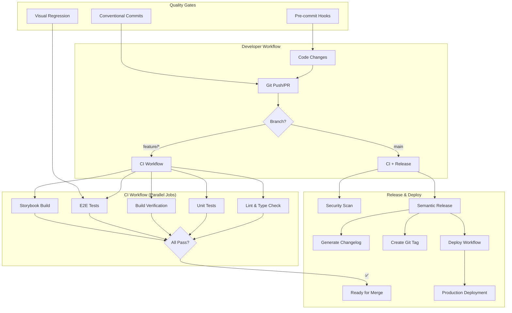
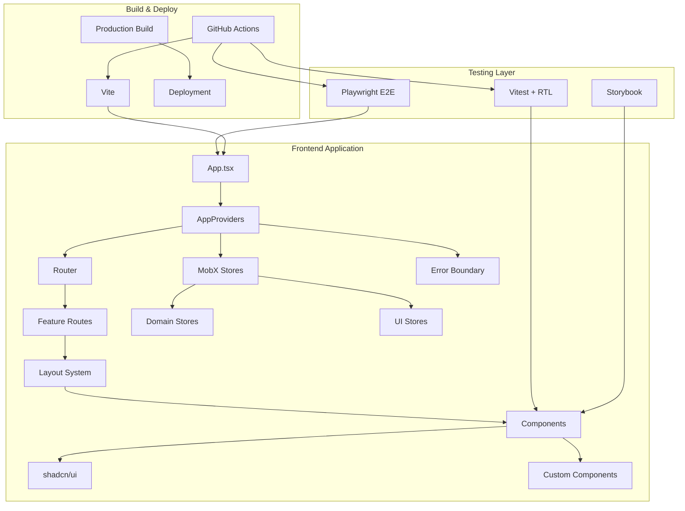
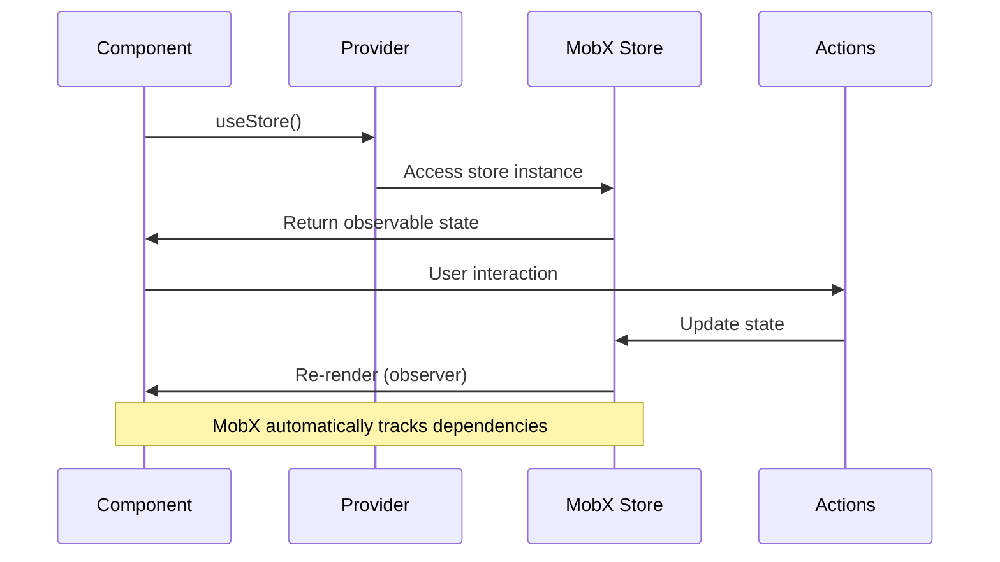
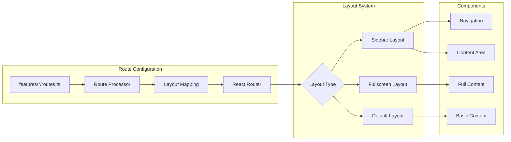
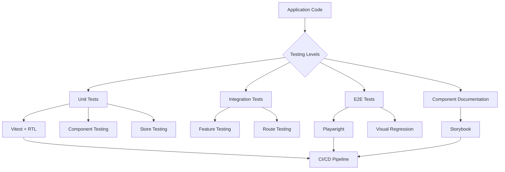

# Coding Challenge Starter Kit

A modern React + TypeScript starter kit for coding challenges with pre-configured tooling and best practices.

## Quick Start

```bash
# Clone and install
git clone [your-repo-url]
cd starter-kit
npm install

# Start development
npm run dev
```

## Available Scripts

```bash
npm run dev          # Start development server
npm run build        # Production build
npm run preview      # Preview production build
npm run test         # Run tests in watch mode
npm run test:unit     # Run unit tests once
npm run test:unit:ui  # Run unit tests with UI
npm run test:e2e      # Run E2E tests
npm run test:e2e:ui   # Run E2E tests with UI
npm run test:e2e:update-ci # Update CI snapshots using Docker
pnpm storybook       # Run Storybook dev server
pnpm storybook:build # Build Storybook static files
pnpm lint:fix        # Auto-fix linting issues
pnpm lint:dead-code  # Find unused files and dependencies
pnpm type:check      # TypeScript type checking
pnpm check:all       # Run all checks
```

## Tech Stack

- **React 19** + **TypeScript 5.8**
- **Vite** - Fast build tool
- **MobX** - State management
- **Tailwind CSS 4** - Utility-first CSS
- **Vitest** + **React Testing Library** - Testing
- **Playwright** - E2E testing with visual regression
- **Storybook** - Component development and documentation  
- **Biome** - Linting & formatting (replaces ESLint + Prettier)
- **Husky** + **lint-staged** - Git hooks for code quality

## CI/CD Pipeline

Automated quality assurance and deployment pipeline:

- **CI Workflow**: Runs on every push/PR - linting, type checking, unit tests, E2E tests, and build verification
- **Release Workflow**: Automated semantic versioning and changelog generation on main branch  
- **Deploy Workflow**: Production deployment after CI passes (ready for Vercel/Netlify)
- **Security Workflow**: Weekly dependency audits and CodeQL security scans

All workflows run in parallel for fast feedback and use GitHub Actions for zero-config automation.

**Visual Regression Testing**: Local snapshots (gitignored) for development, CI snapshots (tracked) for consistent cross-platform testing.

### CI/CD Pipeline Flow



## Architecture Overview

### Project Structure

```
src/
├── components/      # Reusable UI components
├── features/        # Feature modules (your challenge code goes here)
├── stores/          # MobX state management
├── services/        # External integrations
├── hooks/           # Custom React hooks
├── providers/       # React context providers
├── types/           # TypeScript type definitions
└── utils/           # Helper functions
```

### System Architecture



### State Management Flow



### Routing Architecture



### Testing Strategy



## Design Decisions

> Simple explanations of architectural choices made in this starter kit

### Provider Composition Pattern
**What**: All React providers (ErrorBoundary, Router, Stores) are composed in `AppProviders.tsx`
**Why**: Avoids "provider hell" in App.tsx and makes testing easier
**Usage**: Same provider setup in both app and tests

```typescript
// Clean App.tsx
<AppProviders>
  <Routes>...</Routes>
</AppProviders>

// Easy testing
render(<AppProviders><YourComponent /></AppProviders>)
```

### Feature-Based Routing
**What**: Routes are defined in feature folders and automatically processed
**Why**: Keeps related code together and supports layout inheritance
**Usage**: Add routes in `features/[name]/routes.ts`

```typescript
export const myRoutes = {
  path: "/my-feature",
  layout: "sidebar",
  component: MyComponent,
  children: [...]
}
```

### MobX + React Context
**What**: MobX stores accessed via React Context, not direct imports
**Why**: Better testability and cleaner component dependencies
**Usage**: `const { myStore } = useStore()` in components
```

## Coding Challenge Guidelines

### 1. Start with Planning
Before writing any code:
- Read the requirements carefully
- Break down the problem into smaller tasks
- Identify edge cases
- Plan your data structures and component hierarchy

### 2. Validate Your Approach
- Write test cases first (TDD approach)
- Consider performance implications
- Think about error handling
- Plan for edge cases

### 3. Implementation
- Start with the simplest working solution
- Refactor for clarity and performance
- Add proper TypeScript types
- Write meaningful commit messages

### 4. Testing
- Unit tests for utilities and business logic
- Component tests for UI behavior
- Integration tests for features
- Run `npm run test:run` before submitting

### 5. Code Quality
- Run `pnpm check:all` to ensure all checks pass
- Follow existing code patterns
- Keep components small and focused
- Use meaningful variable and function names

## Common Patterns

### State Management with MobX
```typescript
// Create a store
class ChallengeStore {
  constructor() {
    makeAutoObservable(this);
  }
  
  // Your state and actions here
}

// Use in components
const MyComponent = observer(() => {
  const store = useStore();
  // Component logic
});
```

### Custom Hooks
```typescript
// Create reusable logic
function useChallenge() {
  // Hook implementation
  return { /* ... */ };
}
```

### Testing Components
```typescript
import { renderWithProviders } from '@/test-utils';

test('component behavior', () => {
  const { getByText } = renderWithProviders(<MyComponent />);
  // Test assertions
});
```

## Tips for Success

1. **Keep It Simple**: Start with the simplest solution that works
2. **Test Early**: Write tests as you go, not after
3. **Commit Often**: Make small, logical commits
4. **Ask Questions**: If requirements are unclear, ask for clarification
5. **Performance Matters**: Consider performance for large datasets
6. **User Experience**: Think about edge cases and error states

## Submitting Your Solution

1. Ensure all tests pass: `npm run test:run`
2. Run all checks: `pnpm check:all`
3. Review your code for clarity and completeness
4. Commit your changes with clear messages
5. Push to your repository

## Need Help?

- Check the [Architecture Guide](./docs/architecture.md) for detailed patterns
- Review existing code in `src/features/` for examples
- Use TypeScript types for better IDE support
- Keep the browser console open for debugging

---

Good luck with your coding challenge! 🚀