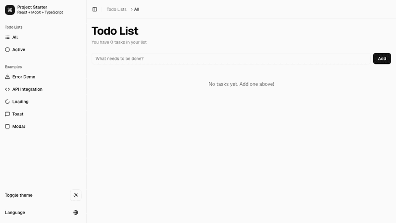

# React Starter Kit

A modern React + TypeScript starter with batteries included. Pre-configured tooling, component library, and example implementations to help you start building immediately.

## 🚀 Live Preview

**[View Live Demo](https://react-mobx-starter-eight.vercel.app/)** - Deployed on Vercel



*Interactive demo showing the complete user flow: adding todos, marking as complete, and viewing statistics.*

## ⚡ Quick Start

```bash
pnpm install
pnpm dev
```

Open [http://localhost:5173](http://localhost:5173) - you're ready to code.

## 🛠️ What's Included

- **⚡ Vite** - Lightning-fast builds and HMR
- **🎨 Tailwind CSS + shadcn/ui** - Modern styling and components
- **🔄 MobX** - Reactive state management
- **📝 TypeScript** - Type safety with strict mode
- **🧪 Testing** - Vitest + Playwright + Visual regression
- **📚 Storybook** - Component development and documentation
- **🔍 Code Quality** - Biome linting, pre-commit hooks
- **🚀 CI/CD** - GitHub Actions pipeline
- **🐳 Docker** - Development and production containers

## 📁 Project Structure

```
src/
├── features/           # Business features (your main code)
│   └── todo/          # Example: Complete todo app
├── components/        # Reusable UI components
│   ├── ui/           # shadcn/ui components
│   └── custom-ui/    # Custom components + FormBuilder
├── stores/           # Global MobX stores
├── providers/        # React context providers
├── hooks/            # Custom React hooks
├── lib/              # Utilities and shared logic
└── services/         # API clients
```

## 🎯 Key Features

### Feature-Based Architecture
Each feature is self-contained with its own components, state, and routes:

```typescript
features/my-feature/
├── Component.tsx     # UI components
├── store.ts         # MobX store
├── routes.ts        # Route configuration
├── schemas.ts       # Zod validation
└── index.ts         # Feature registry
```

### Schema-First Development
Types derived from Zod validation schemas:

```typescript
// schemas.ts
export const TodoSchema = z.object({
  id: z.string().min(1),
  text: z.string().min(1).trim(),
  completed: z.boolean()
})

// types.ts
export type Todo = z.infer<typeof TodoSchema>
```

### Dynamic Form Builder
Powerful form generation with validation:
- All field types included
- Zod schema integration
- Field arrays and nested forms
- See examples in Storybook

## 🚀 Commands

| Command | Description |
|---------|-------------|
| `pnpm dev` | Start development server |
| `pnpm build` | Build for production |
| `pnpm test` | Run unit tests |
| `pnpm test:e2e` | Run E2E tests |
| `pnpm storybook` | Start Storybook |
| `pnpm lint` | Run linter |
| `pnpm type:check` | Check TypeScript |

[View all commands →](CONTRIBUTING.md#scripts-reference)

## 🐳 Docker

```bash
pnpm docker:dev       # Development with hot reload
pnpm docker:prod      # Production build
```

## 📚 Documentation

| Guide | Description |
|-------|-------------|
| [**Contributing**](CONTRIBUTING.md) | Development setup, workflows, code quality |
| [**Architecture**](docs/ARCHITECTURE.md) | System design, patterns, project structure |
| [**Testing**](docs/TESTING.md) | Unit, E2E, visual regression strategies |
| [**Deployment**](docs/DEPLOYMENT.md) | CI/CD, Docker, production deployment |

## 🔧 Getting Started

### 1. Create a New Feature
```bash
# Create feature folder
mkdir src/features/my-feature
cd src/features/my-feature

# Required files
touch index.ts Component.tsx routes.ts schemas.ts
```

### 2. Add UI Components
```bash
# Add shadcn components
npx shadcn@latest add button card

# Check existing components
ls src/components/ui/
```

### 3. Explore Examples
- **Todo App** - Complete CRUD with MobX state
- **API Demo** - External API integration
- **Form Builder** - Dynamic form generation

## ✨ What Makes This Different

- **Zero Configuration** - Works out of the box
- **Production Ready** - CI/CD, testing, Docker included
- **Developer Experience** - Storybook, hot reload, type safety
- **Scalable Architecture** - Feature-based organization
- **Modern Stack** - Latest tools and best practices

---

**Happy coding!** 🎉

Questions? Check the [Contributing Guide](CONTRIBUTING.md) or open an issue.