# React Starter Kit

A modern React + TypeScript starter with batteries included. Pre-configured tooling, component library, and example implementations to help you start building immediately.

## Quick Start

```bash
npm install
npm run dev
```

Open [http://localhost:5173](http://localhost:5173) - you're ready to code.

## What's Inside?

This starter includes everything you need for a modern React application:

- **Vite** for lightning-fast builds
- **Tailwind CSS** for styling
- **shadcn/ui** component library
- **MobX** for state management
- **Vitest + Playwright** for testing
- **Storybook** for component development
- **TypeScript** with strict mode
- **GitHub Actions** CI/CD pipeline

## Project Structure

```
src/
├── features/           # Feature modules - your main code goes here
│   └── todo/          # Example: Todo app with MobX store
│       ├── TodoStore.ts    # MobX store
│       ├── routes.ts       # Route configuration
│       └── i18n/           # Translations
│
├── components/         # Reusable UI components
│   ├── ui/            # shadcn/ui components (Button, Card, etc.)
│   ├── custom-ui/     # Custom components
│   │   └── FormBuilder/   # Dynamic form generator with Zod
│   └── layout/        # Layout components (Sidebar, Fullscreen)
│
├── stores/            # Global MobX stores
│   └── RootStore.ts   # Store composition root
│
├── providers/         # React providers & app configuration
│   └── AppProviders.tsx  # All providers in one place
│
├── hooks/             # Custom React hooks
├── lib/               # Utility libraries
├── services/          # API clients & external services
└── test/              # Test utilities & mocks

tests/                 # E2E tests
└── e2e/              # Playwright tests
```

## Where to Find Things

### Starting a New Feature?
Create a new folder in `src/features/` with:
- Your components
- Local state/store
- Route configuration (`routes.ts`)
- Keep it self-contained

### Need a UI Component?
- Check `src/components/ui/` for shadcn components
- Check `src/components/custom-ui/` for custom components
- Use `npx shadcn@latest add [component]` to add more

### Working with Forms?
Check out the FormBuilder in `src/components/custom-ui/FormBuilder/`:
- Dynamic field generation
- Zod validation
- All field types included
- See examples in Storybook

### Managing State?
- Feature-specific: Create a store in your feature folder
- Global state: Add to `src/stores/RootStore.ts`
- Access via `useStores()` hook

### Writing Tests?
- Unit tests: Next to your code as `*.test.tsx`
- E2E tests: In `tests/` folder
- Test utilities: `src/test/utils.tsx`

## Available Commands

| Command | Description |
|---------|-------------|
| `npm run dev` | Start development server |
| `npm run build` | Build for production |
| `npm run preview` | Preview production build |
| `npm run test` | Run tests in watch mode |
| `npm run test:ui` | Run tests with UI |
| `npm run lint` | Run linter |
| `npm run type:check` | Check TypeScript types |
| `npm run storybook` | Start Storybook |

## Docker Development

| Command | Description |
|---------|-------------|
| `docker-compose up -d` | Start development environment |
| `docker-compose down` | Stop containers |
| `docker-compose build` | Rebuild containers |
| See [Docker documentation](./docs/docker.md) | Complete Docker setup guide |

## Development Workflow

1. **Feature Development**: Work in `src/features/[your-feature]/`
2. **Component Development**: Use Storybook for isolated development
3. **Testing**: Tests run automatically on save
4. **Linting**: Pre-commit hooks ensure code quality
5. **CI/CD**: GitHub Actions run on every push

## Architecture Overview

### Option 1: Feature Workflow (Current)

```mermaid
graph LR
    subgraph "Your Feature"
        F[📁 features/my-feature/]
        F --> FC[Components.tsx]
        F --> FS[Store.ts]
        F --> FR[routes.ts]
        F --> FI[i18n/en.ts]
    end
    
    subgraph "App Automatically Uses"
        RR[🗂️ Root Router]
        RS[🗃️ Root Store]
        SB[🔧 Sidebar Nav]
    end
    
    subgraph "Your Feature Consumes"
        UI[🎨 UI Components]
        UT[⚙️ Utils]
        SV[🌐 Services]
        HK[🪝 Hooks]
    end
    
    FR --> RR
    FS --> RS
    FR --> SB
    
    FC --> UI
    FC --> UT
    FC --> HK
    FS --> SV
    
    RR -.->|Routes to| FC
    RS -.->|Provides| FS
```


### Option 2: Data Flow

```mermaid
graph LR
    User[👤 User Action] --> Component[📱 Component]
    Component --> Hook[🪝 Custom Hook]
    Hook --> Store[🗃️ MobX Store]
    Store --> API[🌐 API Service]
    API --> Store
    Store --> Component
    Component --> UI[🎨 UI Update]
```


### Option 3: Layered Architecture


### Option 4: File Structure Flow

```mermaid
graph TB
    User[👤 User visits /todos]
    Router[Router Configuration]
    
    subgraph "features/todo/"
        TodoRoute[routes.ts]
        TodoComponent[TodoList.tsx]
        TodoStore[TodoStore.ts]
    end
    
    subgraph "Shared Resources"
        SharedUI[components/ui/]
        SharedUtils[lib/utils.ts]
        SharedHooks[hooks/]
    end
    
    User --> Router
    Router --> TodoRoute
    TodoRoute --> TodoComponent
    TodoComponent --> TodoStore
    TodoComponent --> SharedUI
    TodoComponent --> SharedHooks
    TodoStore --> SharedUtils
```


### Option 5: Developer Mental Model

```mermaid
graph LR
    subgraph "What You Build"
        NewFeature[🆕 New Feature]
        Components[📱 Components]
        BusinessLogic[🧠 Business Logic]
    end
    
    subgraph "What You Get For Free"
        Routing[🗂️ Automatic Routing]
        StateManagement[🗃️ State Management]
        UILibrary[🎨 UI Component Library]
        Testing[🧪 Testing Setup]
        TypeSafety[🔒 Type Safety]
        DevTools[🛠️ Dev Tools]
    end
    
    NewFeature --> Components
    NewFeature --> BusinessLogic
    
    Components --> UILibrary
    BusinessLogic --> StateManagement
    NewFeature --> Routing
    NewFeature --> Testing
    NewFeature --> TypeSafety
    NewFeature --> DevTools
```


### Option 6: System Boundaries


## Key Patterns

### Feature-Based Architecture
Each feature is self-contained with its own components, state, and routes:

```typescript
features/
└── my-feature/
    ├── MyComponent.tsx     # UI components
    ├── MyStore.ts         # MobX store (if needed)
    ├── routes.ts          # Route configuration
    └── types.ts           # TypeScript types
```

### Provider Composition
All providers are composed in one place for cleaner setup:

```typescript
// src/providers/AppProviders.tsx
<ErrorBoundary>
  <StoreProvider>
    <Router>
      {children}
    </Router>
  </StoreProvider>
</ErrorBoundary>
```

### Route Configuration
Routes are defined per feature and automatically processed:

```typescript
// features/my-feature/routes.ts
export const myRoutes = {
  path: "/my-feature",
  component: MyComponent,
  layout: "sidebar", // or "fullscreen"
}
```

## Core Principles

- **Isolation**: Features are independent modules
- **Composition**: Build complex UIs from simple components
- **Type Safety**: Leverage TypeScript for confidence
- **Testing**: Test behavior, not implementation
- **Performance**: Lazy load features, memoize expensive operations

## Examples Included

The starter includes working examples to learn from:

- **Todo App** (`/features/todo/`): MobX state management, CRUD operations
- **API Demo** (`/features/demo/`): External API integration, error handling
- **Home Page** (`/features/home/`): Simple landing page example

## Need More Details?

Check the `/docs` folder for:
- [Architecture decisions](./docs/architecture/README.md)
- [Testing strategy](./docs/development/testing.md)
- [API documentation](./docs/api/hooks.md)
- [Development guidelines](./docs/README.md)

---

Happy coding!